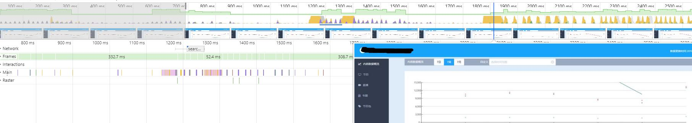
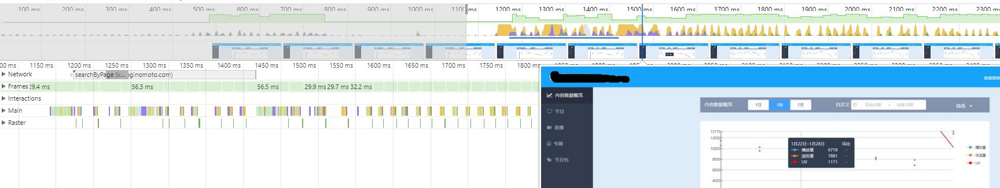

前提概要：在项目前一版本的基础上，产品经理根据既有的UI和功能提出了新的呈现效果和功能改进。然后有了这一版本的需求，再后来，周期拉长时间充足，索性来个性能优化版本。


### BI优化项
>> + 提取项目中的多个页面都用到的属性和事件；
+ 多个页面中用到的组件各自单独组件化；
+ 使用 import动态引入需要的组件或数据；
+ 削弱对第三方插件的依赖，比如，清楚不用或用到的几率很低的包；
+ 针对性引入用到的第三方包里面的事件和组。比如，对element-ui的使用，
```
import select from 'element-ui/lib/select.js';
...

Vue.component(select.name, select);
...
```

### 结果
页面优化前download用时


页面优化后ddownload用时


###### 同页面切换时间点用新数据重新渲染折线图时：
页面优化前的Performance呈现结果



页面优化后的Performance呈现结果

